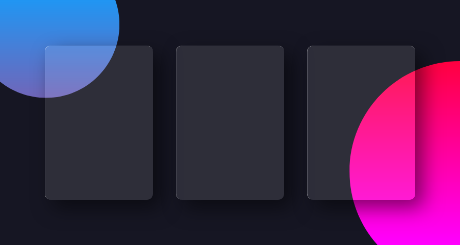

## DESCRIPTION:
- Glassmorphism UI, 3 cards with CSS animation.

## OUTCOME:
- Play with glassmorphism.

## TECH STACKS:
- HTML + CSS
- Library: 
    - vanilla tilt: https://github.com/micku7zu/vanilla-tilt.js/

## PROGRESS:
- Done: 100%.
- Mobile responsive? YES.

    
## View other projects:
- [My Blog](https://hashnode.com/@marizoo)
- [My Pinterest](https://pin.it/16vGwjy)
- [My Youtube Channel](https://www.youtube.com/channel/UCfkbnM9WvHD3mjecBiGHCBQ/playlists)

## IMAGE:
)